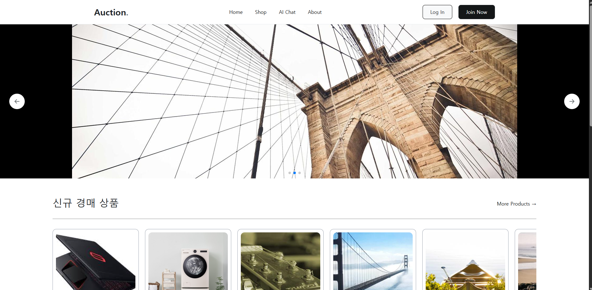
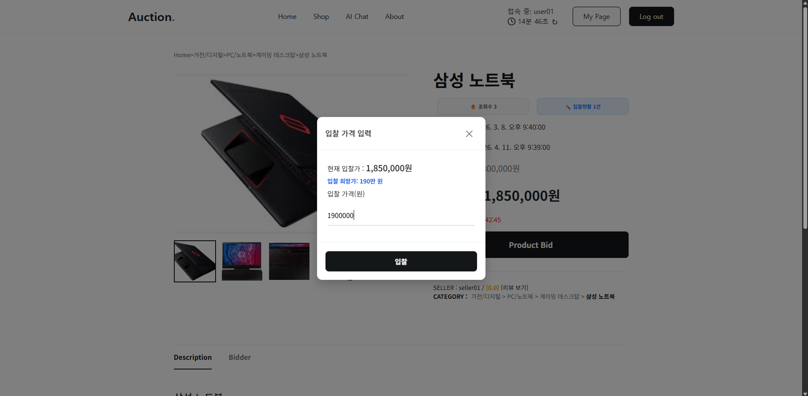
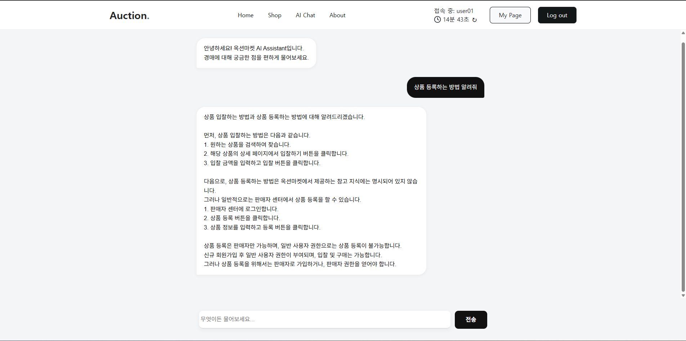
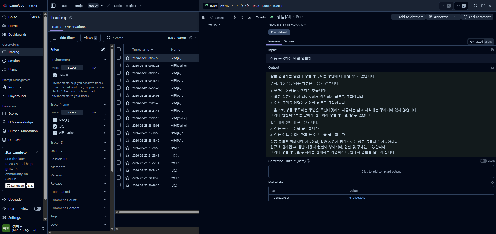
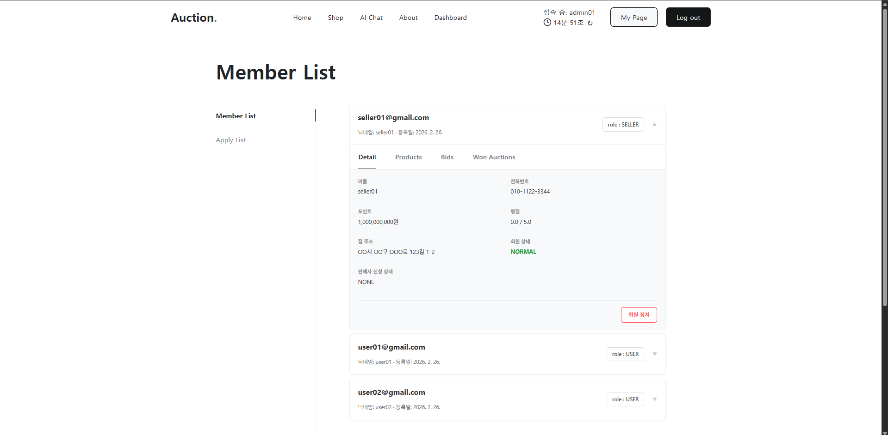
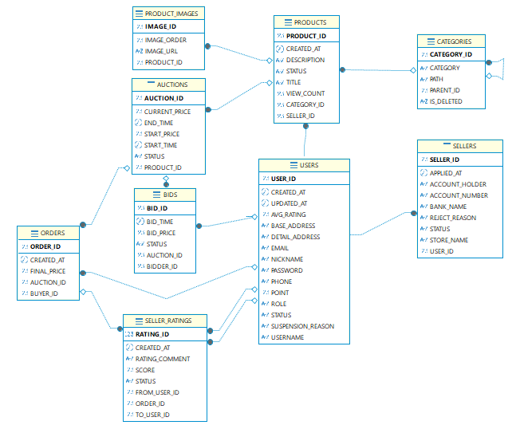

# Auction Market(실시간 경매 사이트)

***
## 프로젝트 소개
본 프로젝트는 사용자 간의 실시간 입찰 시스템을 핵심으로 하며, 백엔드 개발자로서 **데이터 정합성 유지**, **인프라 자동화**, **AI 서비스 통합**이라는 세 가지 기술적 목표를 달성하기 위해 제작되었습니다.

Java 21과 Spring Boot를 기반으로 한 고성능 로직과, Redis 기반의 정교한 경매 상태 관리 시스템이 자리 잡고 있습니다.

### 메인 페이지
>
### 상품 상세/입찰 페이지
>
### AI 상담원
>   
>
### 관리자 페이지
>
***
### 개발 인원: 1인
이름 : 정해훈    
특이사항 : AI(Gemini,Clade)를 개인 멘토로 활용하여 각 기능에 적합한 기술을 배우고 프로젝트에 접목
***
### 개발 기간
2025년 12월 22일 ~ 2026년 3월 3일     
이 후 기간에는 배포 환경에서 짧은 테스트와 오류 확인 후 hotfix로 코드 수정
***
### 기술 스택
* Back-end : JAVA, Spring Boot, JWT, JPA(QueryDSL), Redis, 외부 API(AI, Pinecone, Langfuse, Toss Payments 등)
* DB : 로컬에선 MySQL 사용, 배포환경에선 Oracle 사용
* Infra : OCI VM(1 OCPU/1GB RAM), BaseDB(Oracle DB), Object Storage 사용
* Tool : Docker Desktop, GitHub Desktop, IntelliJ IDEA, DBeaver, Postman
* CI/CD : 초기 설정으로 Jenkins/Kubernetes 사용했으나 배포 환경에서 프리티어 한계로 GitHub Action 사용
* Front-end : React(React Query), Axios, Toss Payments, CSS, HTML
***
## 📊 Database Schema
>    
### ERD
* 데이터 정합성을 위해 5단계 정규화 및 외래 키 제약 조건을 준수하여 설계했습니다.  
* 6단계 정규화는 실시간 기반 프로젝트와 결이 맞지 않기 때문에 생략했습니다.(프로젝트의 성능 우선)
***
## 주요 기능
### 1. Redis 기반의 정교한 경매 마감 시스템
* DB를 매초 검사하는 스케줄러 대신 Redis의 `Sorted Set`에 종료 시간을 점수(Score)로 저장합니다.
* 종료된 경매만 추출하여 낙찰처리를 해주는 스케줄러를 사용하여 서버의 부하를 줄이고 효율적으로 관리합니다.
### 2. JWT 기반 멀티 레이어 보안 체계
* Access Token(15분)과 Refresh Token(7일)을 분리하여 보안성을 강화했습니다.
* Redis에 Refresh Token을 저장하고 관리하며, 안전한 로그아웃 및 토큰 갱신 로직을 구현했습니다.
### 3. 비관적 락으로 데이터 정합성 유지
* 상품 동시 입찰 시 충돌을 해결하기 위해 입찰 대상(Auction)에 비관적 락을 걸어 데이터의 정합성을 유지했습니다.
* 이 후 Redis의 분산 락을 알게 되었으며, 리팩토링을 검토 중 입니다.
### 4. 지능형 고객 지원 시스템 (AI 상담원)
* AI가 저장된 데이터를 참조하여 관련 지식을 추출하는 RAG패턴을 적용했습니다. 
* LLM 비용 최적화를 위해 시맨틱 캐싱을 구현하여 토큰의 사용량을 감소시켰습니다.
* Langfuse를 도입하여 AI 응답의 유사도와 성능을 실시간으로 모니터링합니다.

***
### 💡 인프라 최적화 경험 (Troubleshooting)
* **문제:** OCI 프리티어 환경(1GB RAM)에서 Jenkins와 Kubernetes 운영 시 메모리 부족으로 인한 빌드 중단 및 서버 불안정 현상 발생
* **해결:** 시스템 자원 효율화를 위해 GitHub Actions를 통한 CI/CD 파이프라인으로 전환하고, Docker Compose를 활용하여 Back-end container에 메모리 제한 450M과 하드 디스크 4GB를 스왑 메모리로 할당하여 안전하게 서버를 운영할 수 있도록 설정하였습니다.
* **결과:** 안정적인 배포 환경 확보 및 서버 가용 리소스 40% 이상 개선
***
## 🔗 관련 링크
* **Live Demo**: [https://auction-market.duckdns.org/about](https://auction-market.duckdns.org/about)
* **Frontend Repo**: [https://github.com/jhh0101/portfolio_front](https://github.com/jhh0101/portfolio_front)

